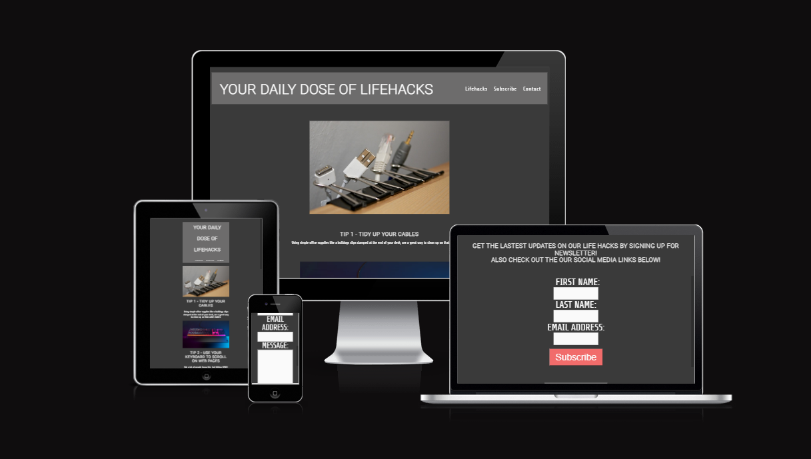
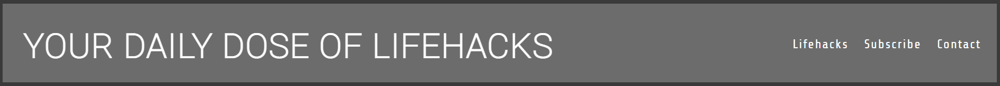
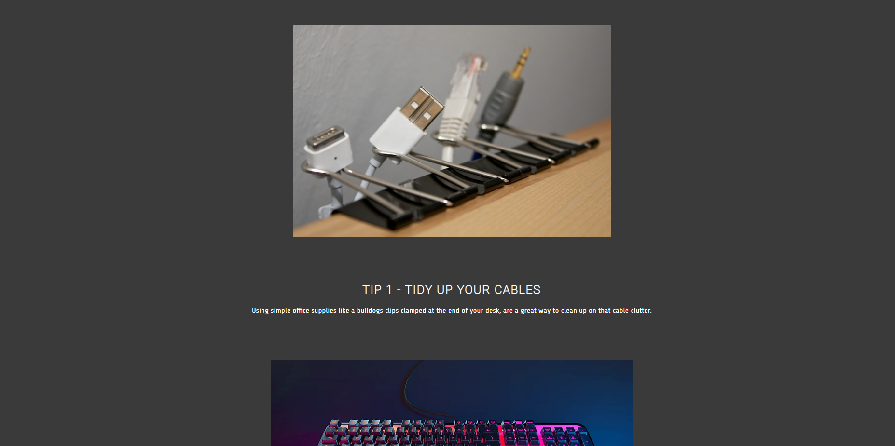
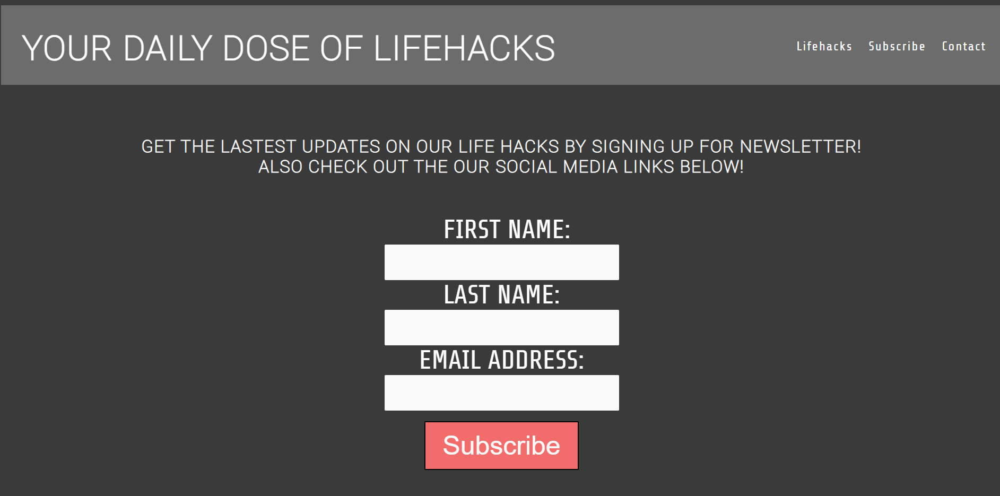
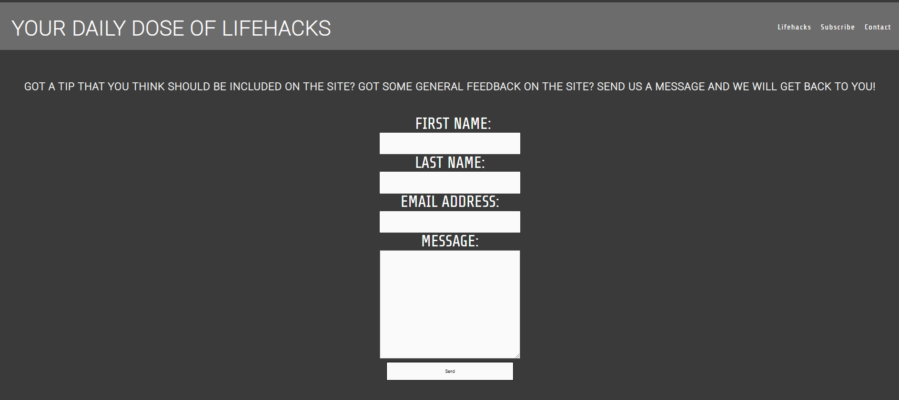
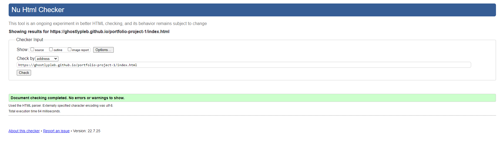
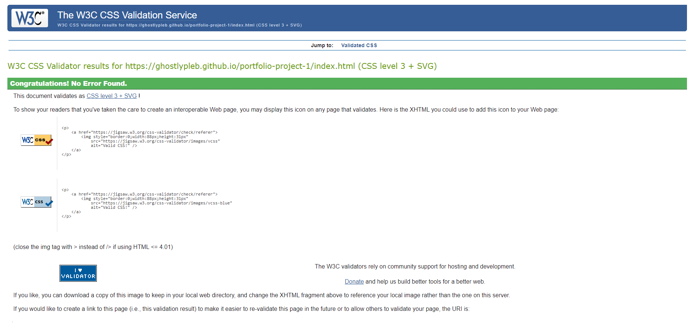
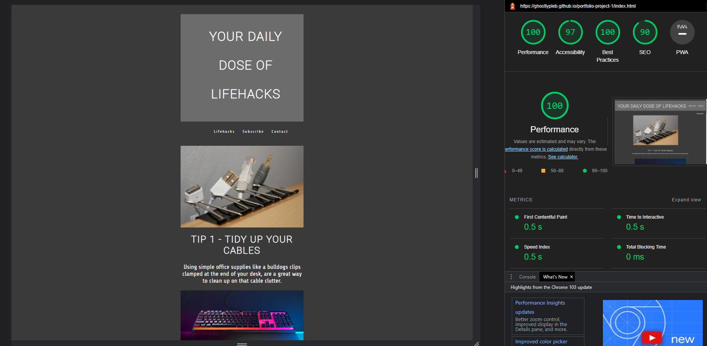

# Your Daily Dose of Life Hacks

Your Daily Dose of Life Hacks is a website designed to aid people in their own day to day lives with little tips and tricks! 

The idea is that the user will be able to come back daily to get new and exciting tips that may make the users day that much easier.

## Features 

- __Navigation__

  - Featured at the top of the page shows the name of the website "YOUR DAILY DOSE OF LIFE HACKS".
  - To the right of the "Lifehacks" Home button is the "Subscribe" button to bring the user to the newsletter page.
  - To the right of the "Subscribe" button is the "contact" button which enable to the user to leave a message/get in contact.
  - The page itself is in a font that is easy to read and contrasts well with the background of the website.

 

- __The Header__

  - The header shows the name of the website on the left hand side and on the right hand size is the button for both the main home page and subscribe page

- __Life Hacks__

  - The life hacks themselves are displayed with the image/example of the hack itself and then a description of the hack/tip underneath the image

- __Subscribe Page__

  - The subscribe page allows the user to subscribe for future updates and email notifications for when new tips/hacks have been released, it asks the user for a first name and last name and email address.

- __Contact Page__

  - TThe contact page allows the user to be able to leave a message or give some feedback on the website.
  

- The about section at the bottom of the page simply has the links to all major social media platforms, click on each icon will direct the user to the corresponding website.

## Testing 

- I tested the webpage in multiple differnet website e.g chrome, firefox and edge. They all worked.
- All the content is easy to ready, which will be indicated in my light house score.
- The form is working correctly aswell apart from it not bringing the user to the 404 error page once they try to submit.
- Both the Lifehacks and Subscribe links bring the user to the corresponding page.

## Bugs

- had issues with aliignment of text in the media querys, seem to be fine now.

### Solved Bugs

- One bug I encountered was making sure that all my images were aligned in each mobile device, I had wrote some CSS that contradicted what I was trying to achieve by not using the correct selectors and also closing sections in the incorrect places, after noticing this and correcting it did I achieve the layout I wanted.

## Validator Testing 

- HTML: no errors were returned when passing through WS3 validator

- CSS: no errors were found when passing through Jigsaw validator

- ACCESSIBILITY: All the colors and fonts that were choosen are easy to ready and accessible by running it through lighthouse in devtools, as shown in the images below

- Images of all the tests

## Deployment

- The was deployed to GitHub pages. The steps to deply are as follows:
- In the Github repository, navigate to the settings tab.
- From the source section drop-down menu, select the master branch.
- Once the master branch has been selected, the page provided the link the completed website
- Here is the live link: https://ghostlypleb.github.io/portfolio-project-1/

## Credits 

I would like to thank both coffee and stack overflow for the aid they provided during this project!
I also referenced the form code that was used in the runner mock project.

## Media

- The icons in the footer were taken from the website Font Awesome
- All the images were collected from google images.
