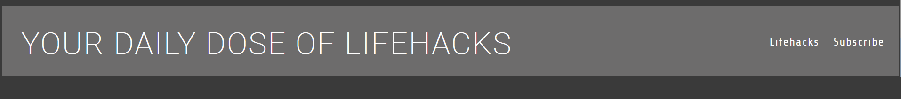

# Your Daily Dose of Life Hacks

Your Daily Dose of Life Hacks is a website designed to aid people in their own day to day lives with little tips and tricks! 

The idea is that the user will be able to come back daily to get new and exciting tips that may make the users day that much easier.

## Features 

- __Navigation__

  - Featured at the top of the page shows the name of the website "YOUR DAILY DOSE OF LIFE HACKS".
  - To the left the "Lifehacks" Home button and the "Subscribe" button to bring the user to the newsletter page.
  - The page itself is in a font that is easy to read and contrasts well with the background of the website.

 

- __The Header__

  - The header shows the name of the website on the left hand side and on the right hand size is the button for both the main home page and subscribe page

- __Life Hacks__

  - The life hacks themselves are displayed with the image/example of the hack itself and then a description of the hack/tip underneath the image

- __Subscribe Page__

  -

- __The Footer__ 

  

- 

## Features Left to Implement

- A better send button
-Actions in the form element, right now it's just static.

## Testing 

### Validator Testing 

## Deployment

## Credits 

- The icons in the footer were taken from the website Font Awesome

### Media
